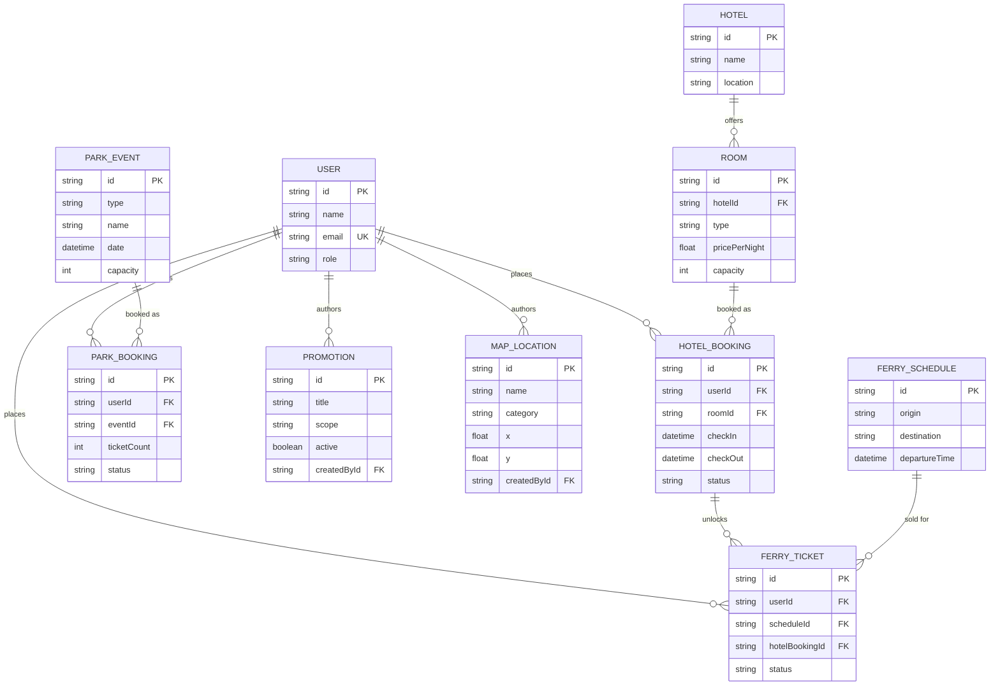

# Conceptual Model — Picnic Island Booking System

This is the conceptual (entity-relationship) model behind the system. It's
derived directly from the working implementation in `prisma/schema.prisma`,
not the aspirational feature list in the brief — every entity and
relationship below has a corresponding table and a working screen in the app.

## Entities

| Entity | What it represents |
|---|---|
| **User** | Anyone with an account — a Visitor, or one of the four staff roles (Hotel, Ferry, Park, Admin). Role is a single field, not a separate table, since a user has exactly one role at a time. |
| **Hotel** | One of the resorts on the island. |
| **Room** | A room type within a hotel (e.g. "Deluxe Lagoon Suite"), with its own price, capacity, and unit count. |
| **HotelBooking** | A visitor's stay in a room for a date range. |
| **FerrySchedule** | A single sailing (route + departure time + capacity). |
| **FerryTicket** | A visitor's booking on a sailing — always tied to one `HotelBooking`, which is what enforces the "ferry tickets require a valid hotel booking" rule from the brief. |
| **ParkEvent** | A ride, show, or beach event, with its own date/time/capacity/price. |
| **ParkBooking** | A visitor's tickets for one `ParkEvent`. |
| **Promotion** | An advertised offer, scoped to Hotel, Park, or the whole site, authored by a staff member or admin. |
| **MapLocation** | A pin on the island map, authored by an admin. |

## Relationships

- A **User** can place many **HotelBooking**s, **FerryTicket**s, and
  **ParkBooking**s (1‑to‑many from User).
- A **Hotel** has many **Room**s; a **Room** has many **HotelBooking**s.
- A **HotelBooking** can have many **FerryTicket**s (a guest may book more
  than one sailing against the same stay), but every **FerryTicket** must
  reference exactly one **HotelBooking** — this foreign key is the
  enforcement mechanism for the ferry/hotel dependency rule.
- A **FerrySchedule** has many **FerryTicket**s.
- A **ParkEvent** has many **ParkBooking**s.
- A **User** (staff/admin) authors many **Promotion**s and **MapLocation**s.

## Diagram

