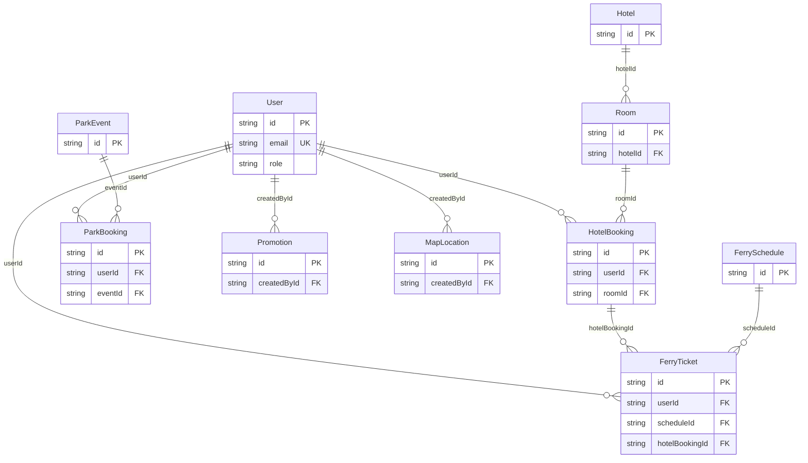

# Relational Schema — Picnic Island Booking System

Standard relational notation, `Table(PK, attributes, FK → ReferencedTable)`,
matching `prisma/schema.prisma` and the live SQLite database exactly.

```
User(id PK, name, email UK, passwordHash, role, createdAt)

Hotel(id PK, name, description, location)

Room(id PK, hotelId FK → Hotel.id, type, pricePerNight, capacity, totalUnits)

HotelBooking(id PK, userId FK → User.id, roomId FK → Room.id,
             checkIn, checkOut, guests, status, totalPrice, createdAt)

FerrySchedule(id PK, origin, destination, departureTime, capacity)

FerryTicket(id PK, userId FK → User.id, scheduleId FK → FerrySchedule.id,
            hotelBookingId FK → HotelBooking.id NOT NULL,
            passengers, status, issuedAt)

ParkEvent(id PK, type, name, description, date, time, capacity, price)

ParkBooking(id PK, userId FK → User.id, eventId FK → ParkEvent.id,
            ticketCount, status, createdAt)

Promotion(id PK, title, description, imageEmoji, scope, active,
          createdById FK → User.id, createdAt)

MapLocation(id PK, name, description, category, x, y,
            createdById FK → User.id, createdAt)
```

## Notes on normalization (3NF)

- Every non-key attribute depends only on its table's primary key (no
  transitive dependencies) — e.g. `HotelBooking.totalPrice` is stored
  per-booking rather than recomputed, since it's a snapshot of price at time
  of booking (rooms can change price later without altering past bookings'
  totals).
- `Role` is a single enum column on `User` rather than a join table, since
  the app only needs one active role per account at a time — a
  many-to-many `UserRole` table would be unnecessary normalization for a
  relationship that's actually 1‑to‑1 in this domain.
- The `FerryTicket.hotelBookingId` foreign key (required, not nullable) is
  the single point where the "ferry tickets require a valid hotel booking"
  business rule from the brief is enforced at the schema level — it's
  physically impossible to create a `FerryTicket` row without a valid
  `HotelBooking` reference.
- All child records cascade-delete with their parent (`onDelete: Cascade`)
  — e.g. deleting a `Room` deletes its `HotelBooking`s — since an orphaned
  booking pointing at a nonexistent room has no valid interpretation in this
  domain.

## Diagram (with PK/FK)


