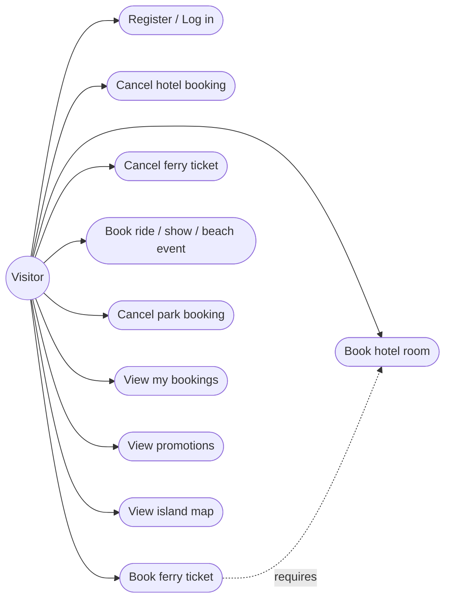
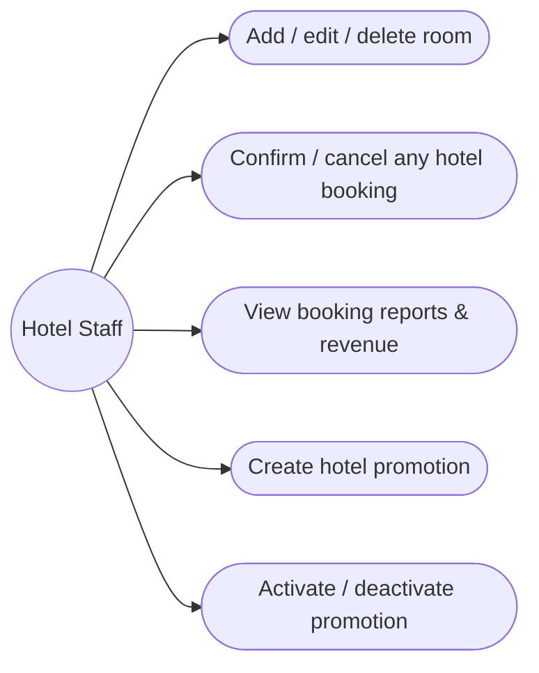
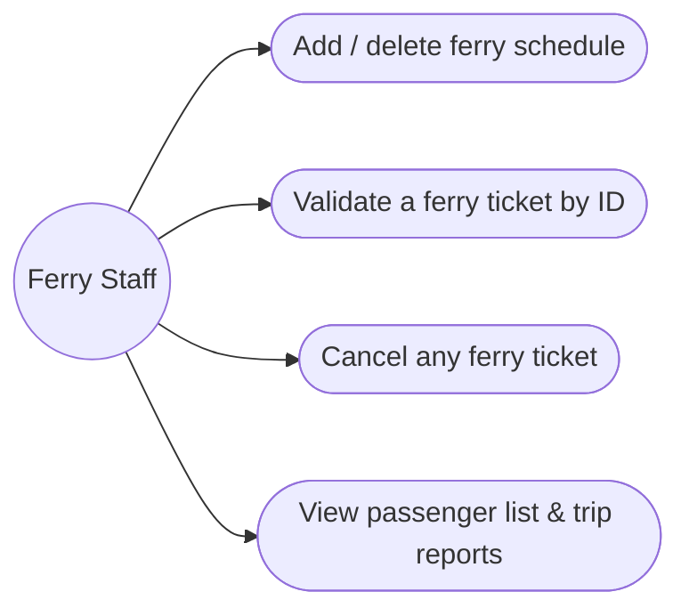
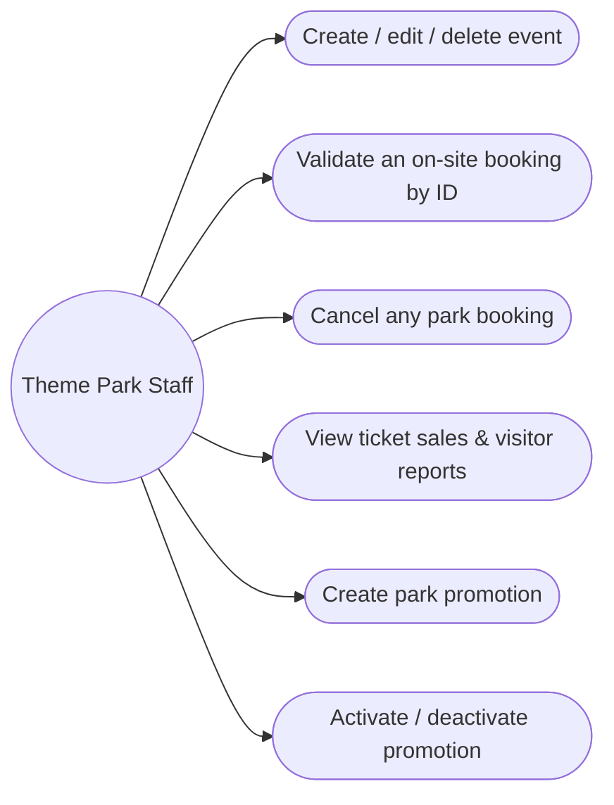
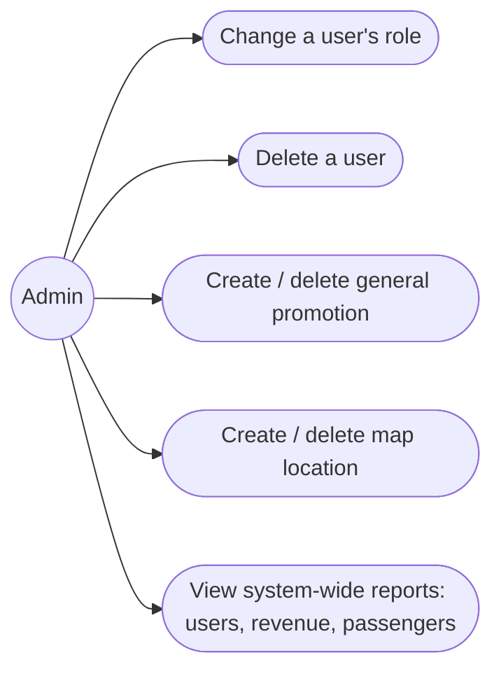

# Use Case Diagrams — Picnic Island Booking System

These list only use cases that are actually implemented and working in the
app (traceable to a route in `src/app/` and a server action in
`src/lib/actions/`), not the full aspirational list from the assignment
brief. Mermaid has no native UML use-case notation, so each actor is
diagrammed as a flowchart with stadium-shaped nodes standing in for use-case
ovals — the actor/use-case relationships are equivalent to a standard UML
use-case diagram.

## Visitor

| Use case | Implemented in |
|---|---|
| Register / log in / log out | `src/app/register`, `src/app/login`, `src/lib/actions/auth.ts` |
| Book a hotel room | `src/app/hotels/book/[roomId]`, `bookHotelAction` |
| Cancel a hotel booking | `src/app/bookings`, `cancelHotelBookingAction` |
| Book a ferry ticket (requires a confirmed hotel booking) | `src/app/ferry`, `bookFerryAction` |
| Cancel a ferry ticket | `src/app/bookings`, `cancelFerryTicketAction` |
| Book a theme park ride / show / beach event | `src/app/park/book/[eventId]`, `bookParkEventAction` |
| Cancel a park booking | `src/app/bookings`, `cancelParkBookingAction` |
| View all bookings + confirmation/payment screens | `src/app/bookings`, `src/app/bookings/confirmation` |
| View promotions | `src/app/page.tsx` (homepage) |
| View the interactive island map | `src/app/map` |

## Hotel Staff

## Ferry Staff

## Theme Park Staff

## Admin

